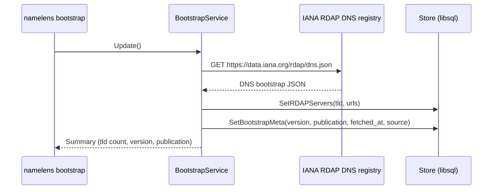
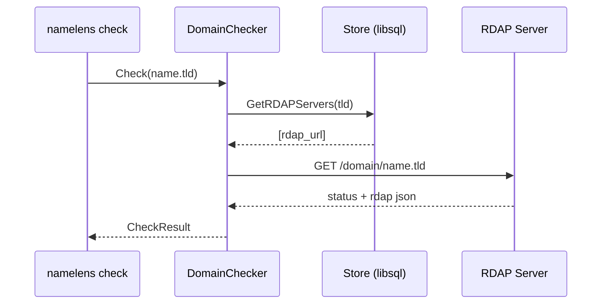

# RDAP Domain Checking Architecture

This document describes the RDAP bootstrap and domain check flow used in
NameLens v0.1.x, including constraints and planned scalability improvements.

## Overview

NameLens uses the IANA RDAP bootstrap registry to map TLDs to RDAP servers and
then queries the RDAP domain endpoint to determine availability.

```mermaid
flowchart LR
    CLI[CLI: namelens check] -->|name + tlds| Checker[DomainChecker]
    CLI --> Store[Store (libsql)]
    Checker -->|lookup tld| Store
    Store -->|rdap server URLs| Checker
    Checker -->|HTTP RDAP| RDAP[RDAP Server]
    RDAP -->|response| Checker
    Checker -->|CheckResult| CLI
```

## Bootstrap Flow



## Domain Check Flow



## Availability Mapping

- 404: Available
- 200 + domain object: Taken
- 429: Rate limited (Retry-After captured)
- 5xx: Error
- No server mapping: Unsupported

## Known Constraints (v0.1.x)

- Single-server usage: the checker uses the first RDAP URL returned by the
  bootstrap registry. Most TLDs provide one URL, so this is acceptable for
  initial usage, but it does not try fallback servers if the first URL fails.
- No retry/backoff: RDAP errors and timeouts are surfaced as AvailabilityError
  without retries. This will be handled in Phase 5 (rate limiting/backoff).
- No cache utilization for checks yet: bootstrap caching is stored in the DB,
  but domain check caching is deferred to later phases.

## Planned Improvements

- Retry/backoff policy (Phase 5)
- Optional multi-server fallback for TLDs with multiple RDAP endpoints
- Domain check caching and rate-limit state persistence
